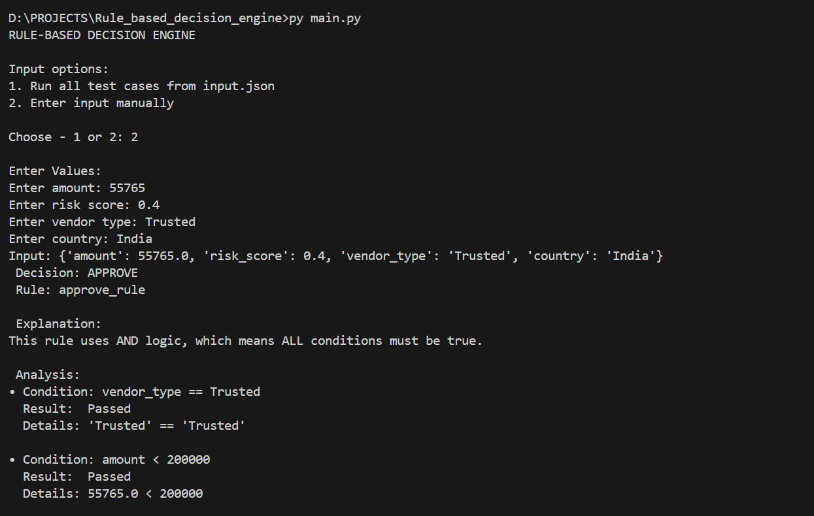
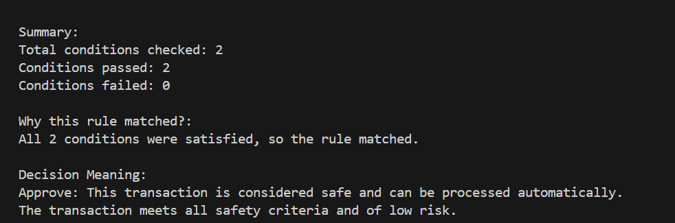
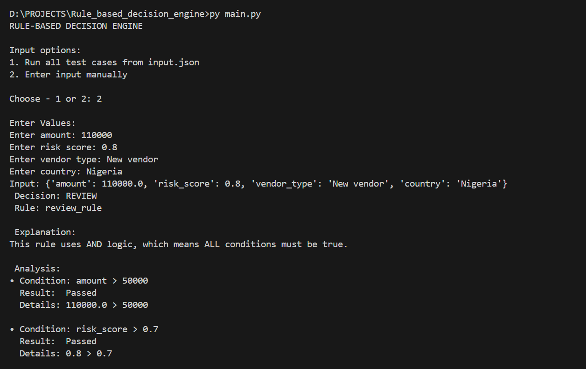
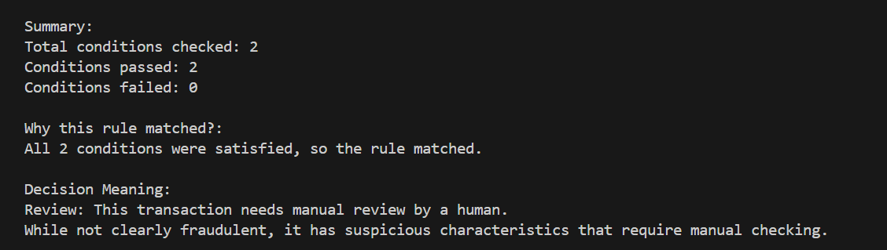
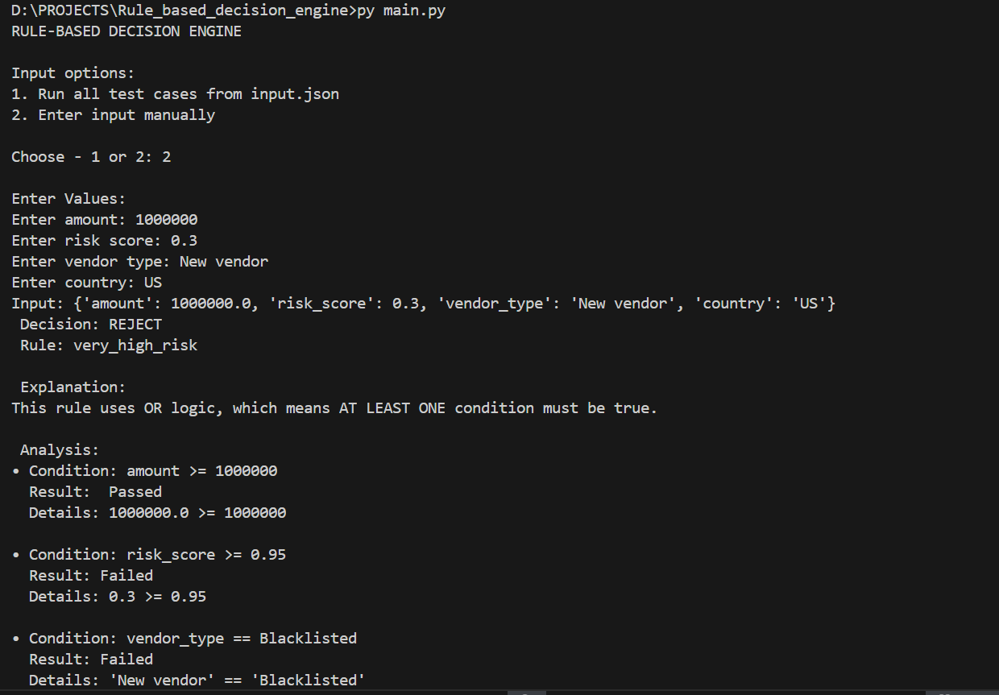
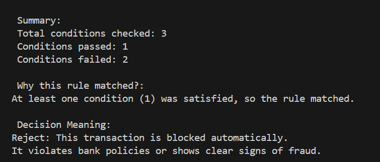

# Configurable Rule Based Decision Engine 
## Developed as part of Intellifer Technical Coding Assessment.

A simple configurable rule-based decision engine built using Python and JSON. It evaluates input records against external rules and produces a decision with clear explainability.

---

## Project Overview

This project demonstrates how business rules can be defined in JSON and evaluated dynamically without changing code. The engine supports nested conditions, AND/OR logic, and detailed reasoning output.

---

## Project Structure
rule_based_decision_engine/

├── rules.json

├── input.json

├── engine.py

├── evaluation.py

├── validation.py

├── main.py

--- 

## Features

-  Rules editable via JSON  
-  AND / OR logic support  
-  Nested rule groups  
-  Operators supported:
  - `>`
  - `<`
  - `>=`
  - `<=`
  - `==`
  - `!=`
  - `IN`
  - `NOT IN`
-  Explainability output  
-  Input validation  
-  Error handling  
- Runs locally via command line  

---

##  Rule Format

Example rule:

```json
{
  "id": "review_rule",
  "decision": "REVIEW",
  "logic": "AND",
  "conditions": [
    { "field": "amount", "operator": ">", "value": 50000 },
    { "field": "risk_score", "operator": ">", "value": 0.7 }
  ]
}
```

---
## Project Setup
1. Clone the repository
```
git clone https://github.com/ashhwiithac22/Configurable_Rule_based_decision_engine.git
cd Configurable_Rule_based_decision_engine
```

2. Run the program
```
 python main.py
```

3️. Choose input mode

- Option 1 → Run predefined test cases
- Option 2 → Enter input manually

--- 

## Sample Input
```json
{
  "amount": 75000,
  "risk_score": 0.8,
  "vendor_type": "New vendor",
  "country": "US",
  "customer_age": 35
}
```
--- 
### Sample Output
```
DECISION: REVIEW
RULE: review_rule

EXPLANATION:
• This transaction needs manual review by human.
• It has may have some fraudulent characteristics, that requires manual checking
```
--- 

## Screenshots
###  APPROVE - Decision


###  APPROVE - Explainability


###  REVIEW - Decision


### REVIEW -  Explainability


### REJECT - Decision


### REJECT -  Explainability


--- 
## Validation Handled

The engine validates the following:

- Invalid rules
- Unsupported operators
- Missing input fields
- Wrong data types
- Invalid JSON files
--- 


